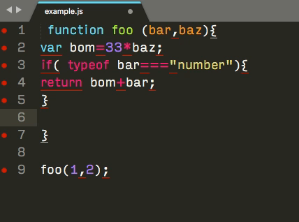

# eslint-auto-fix

Uses your existing ESLint configuration to automatically fix your JS files every time you save.
Great for productivity.



## Installation

```bash
npm i --save-dev eslint-auto-fix
```

## Usage

```bash
npx eslint-auto-fix
```

Or add it to your package.json

```json
{
  "scripts": {
    "fix-js": "eslint-auto-fix"
  }
}
```